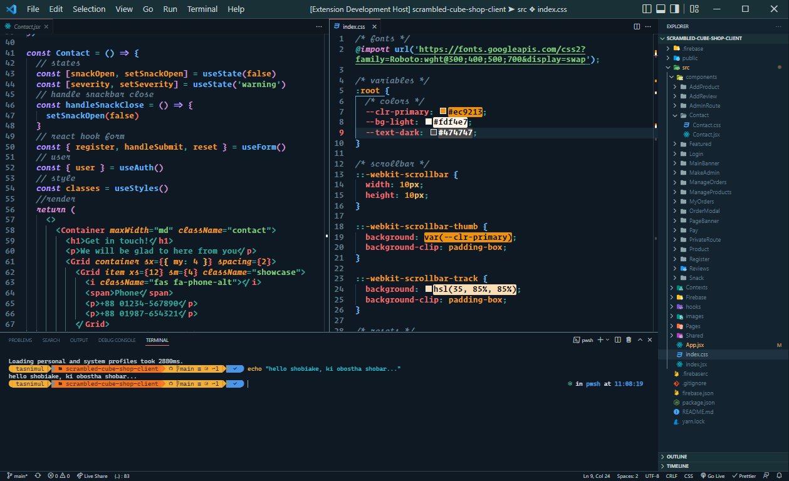

# Valorant Theme

### Don't see an install button?

Hit `ctrl` + `p` and run the following command:

```
ext install TasnimulHasan.valorant-theme
```

## Screenshots



<hr>

### Want to use valorant theme as a starting point?

- Make a copy of the `remastered` folder within `src` directory with the name of your desire.
- Add your variant inside the `themes` array in `package.js` file like below:
  ```js
  {
        label: 'Shows when switching theme',
        uiTheme: 'vs-dark',
        path: 'name-of-your-folder',
  }
  ```
- Do the same thing with `package.json` but a bit differently:

  ```json
  {
    "label": "Same as above",
    "uiTheme": "vs-dark",
    "path": "themes/name-of-your-folder.json"
  }
  ```

- Hit `f5` and a new instance of vs code should open. Any changes you make (as long as that doesn't break anything) will show up live in that window.
- Run `node src` everytime you make some tweeks. Otherwise, you won't see the changes.
- Almost forgot 😅. Change the informations in `package.json` file according to your wish.
- And you are ready to rock 🤘.

### Don't know how to publish it?

Here, watch this or [click here](https://youtu.be/pGzssFNtWXw?t=597):

[](https://youtu.be/pGzssFNtWXw?t=597)

### Still have issues?

দূরে গিয়া মর
